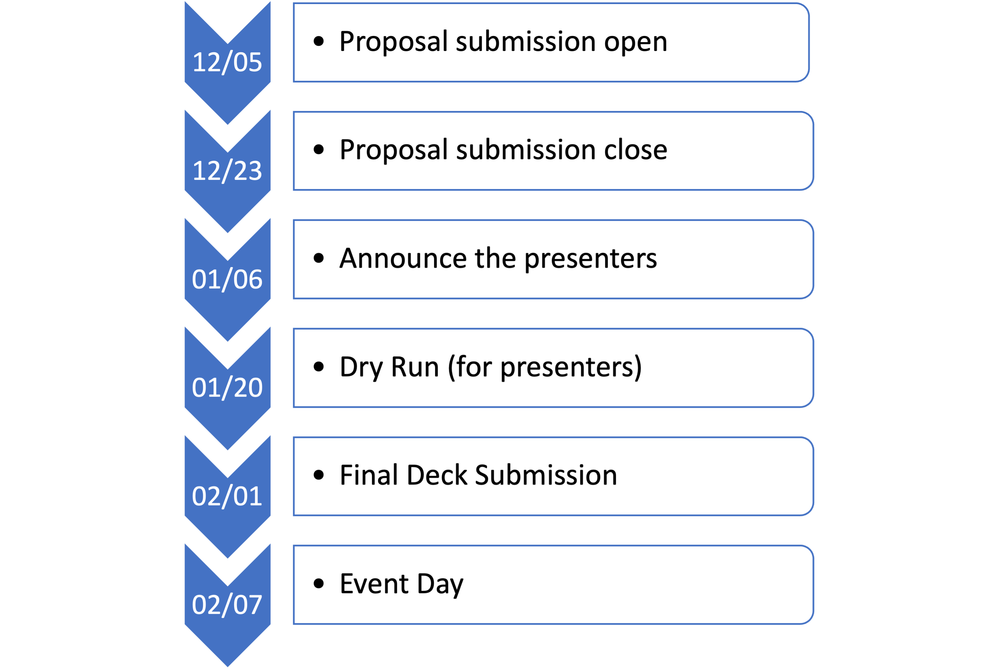

Welcome to the Data Science Conference Page!
===================================

Introduction
--------
The Conference Committee is delighted to announce that we aim to host our 1st Blend360 Data Science Conference at the beginning of 2023. This is an excellent platform where we will connect, celebrate all the best work we have done in 2022, and be inspired by the intensive discussions and exchange of innovative ideas. The scope of the conference includes discussions covering all sorts of DS areas and their applications in various industries and domains. 
Through this conference, we encourage you to:   

- **Engage**: within the team, open the year strong  

- **Inspire**: share the best of our work 

- **Recognize**: the good work 

Timeline
--------
Submitt your proposal here - https://forms.office.com/r/h5GgLf7KYe 

Venue
--------
Maryland Innovation Center, 1st Floor 

**Address**: 6751 Columbia Gateway Dr, Columbia, MD 21046 

https://my.matterport.com/show/?m=YAf45c282yv

Agenda
--------

+------------------------+----------------------------------------------------+
| 08:00 – 08:45AM        | Check-in & Breakfast Reception                     |
+------------------------+----------------------------------------------------+
| 08:45 – 09:00AM        | Welcome                                            |
+------------------------+----------------------------------------------------+
| 09:00 – 09:30AM        | Keynote Address (External Presenter)	              |
+------------------------+----------------------------------------------------+
|**Technical Talks Session**                                                  |
+------------------------+----------------------------------------------------+
| 09:30 - 10:00AM        | Talk I                                             |
+------------------------+----------------------------------------------------+
| 10:00 – 10:10AM        | Break                                              |
+------------------------+----------------------------------------------------+
| 10:10 – 10:40AM        | Talk II                                            |
+------------------------+----------------------------------------------------+
| 10:40 – 11:10AM        | Talk III                                           |
+------------------------+----------------------------------------------------+
| 11:10 – 11:20AM        | Break                                              |
+------------------------+----------------------------------------------------+
| 11:20 – 11:50AM        | Talk IV                                            |
+------------------------+----------------------------------------------------+
| 11:50 – 12:50AM        | Lunch Break                                        |
+------------------------+----------------------------------------------------+
| 12:50 – 14:05PM        | Fun & Team Events                                  |
+------------------------+----------------------------------------------------+
| 14:05 – 14:10PM        | Break                                              |
+------------------------+----------------------------------------------------+
| 14:10 – 15:45PM        | Talk V                                             |
+------------------------+----------------------------------------------------+
| 15:45 – 16:15PM        | Talk VI                                            |
+------------------------+----------------------------------------------------+
| 16:15 – 16:20PM        | Break                                              |
+------------------------+----------------------------------------------------+
|                       **Lightning Talk Session**                            |
+------------------------+----------------------------------------------------+
| 16:20 – 17:10PM        | Lightning Talks                                    |
+------------------------+----------------------------------------------------+
| 17:10 – 17:35PM        | Closing Address                                    |
+------------------------+----------------------------------------------------+
| 17:35 – 18:30PM        | Happy Hour                                         |
+------------------------+----------------------------------------------------+	      

Q&A
--------
- **Who will be attending the conference?**
 
  All DS team will be attended either remotely or in person.   
  
- **Who could submit their proposal?**
  
  Anyone who has great content to share with the whole team should consider submitting your proposal.  
  
- **What kind of topics could you present at the conference?**

  The presentation could either be from your Center of Excellent (CoE) works, client use cases, or anything DS-related.   
  
- **What is lighting talk?**

  A lightning talk is a short presentation lasting only 10 minutes. The goal of lightning talks is to articulate a topic in a quick, insightful, and clear manner. For more description, please see here: https://en.wikipedia.org/wiki/Lightning_talk 

- **How is the conference different from a knowledge share session?**
  
  DS conference is more than sharing knowledge! For presenters, they are challenged to provide public speeches.  For attendees, you are invited to take one day off from work and join us to recognize and celebrate the best of our work and to get inspired by invited to take one day off from work and join us to recognize and celebrate the best of our work, and to get inspired by m your peers and the external speaker. Of course, there are tons of socializing opportunities and fun events for team bonding!  
  
- **Have more questions?**

  Feel free to email us with any questions - confcommittee@blend360.com 
